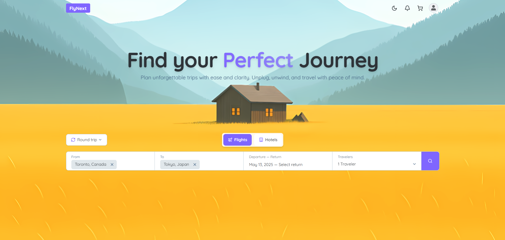

<picture>
  <source srcset="assets/dark-screenshot.png" media="(prefers-color-scheme: dark)">
  
</picture>

  Switch your device's theme to dark or light mode to preview both versions of the FlyNext landing page.

# FlyNext: your most reliable travel companion!

FlyNext is a travel booking platform built with Next.js that allows users to search and book flights/hotels with ease. This repository contains the final implementation of the CSC309 project at the University of Toronto Mississauga

## Notable Features

- **Real-time flight & hotel search** with external API integration and autocomplete
- **Secure JWT authentication** with user login/registration and profile management
- **Complete booking system** with PDF invoices, payment validation, and full/partial cancellation
- **Hotel management dashboard** for owners with analytics and inventory control
- **Live notifications** with real-time updates and booking verification
- **Clean UI** with dark/light mode and smooth navigation
- **Full-stack TypeScript** with PostgreSQL, Docker deployment, and RESTful APIs

## Learning Experiences
- Built a full-stack application from scratch with no prior experience
- How to divide tasks in a team using Git workflow 
- Leveraging AI tools (ChatGPT, Claude) to accelerate development and problem-solving
- Quickly learning new frameworks and libaries while meeting tight deadlines

## Final Grades
Out of 150+ groups, our website was selected as one of the top 4 and showcased as a front-runner. This was despite having 2/3 members with one absent groupmate dropping the course last minute. The final grade we receieved for this project was 108%. 

All proof of assignment documentation, final marks, project front runners, and commit messages are uploaded in [project_docs_and_proof](./project_docs_and_proof/).